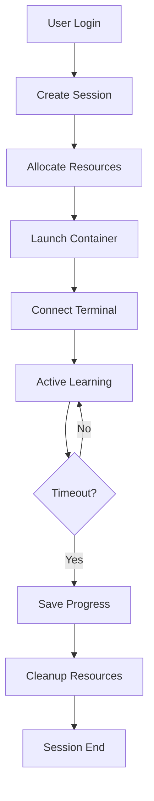

# Kubernetes Learning Lab - Web Platform Architecture

## 🎯 Vision
Transform the local learning lab into a secure, scalable web-based platform where users worldwide can learn Kubernetes hands-on without any local setup.

## 🏗️ Architecture Overview

```
┌──────────────────────────────────────────────────────────┐
│                   Web Frontend (React/Vue)                │
│  - Interactive lessons with HTML/CSS                      │
│  - Web-based terminal (xterm.js)                         │
│  - Progress tracking dashboard                           │
│  - Real-time validation feedback                         │
└─────────────────────┬────────────────────────────────────┘
                      │ HTTPS/WSS
┌─────────────────────▼────────────────────────────────────┐
│                  API Gateway (nginx/traefik)              │
│  - SSL termination                                       │
│  - Rate limiting                                         │
│  - Load balancing                                        │
└─────────────────────┬────────────────────────────────────┘
                      │
┌─────────────────────▼────────────────────────────────────┐
│               Backend Services (Node.js/Go)               │
│  - Authentication & session management                    │
│  - User progress tracking                                │
│  - Resource allocation                                   │
│  - WebSocket terminal proxy                              │
└─────────────────────┬────────────────────────────────────┘
                      │
┌─────────────────────▼────────────────────────────────────┐
│            Container Orchestration Layer                  │
│                                                           │
│  ┌─────────────────────────────────────────────────┐    │
│  │         User Isolation (per-user namespace)      │    │
│  │                                                   │    │
│  │  ┌──────────────┐  ┌──────────────┐            │    │
│  │  │ User's kind  │  │   Terminal   │            │    │
│  │  │   Cluster    │  │   Container  │            │    │
│  │  └──────────────┘  └──────────────┘            │    │
│  │                                                   │    │
│  │  Resource Limits:                                │    │
│  │  - 2GB RAM per user                             │    │
│  │  - 2 CPU cores                                  │    │
│  │  - 10GB storage                                 │    │
│  │  - 1 hour session timeout                       │    │
│  └─────────────────────────────────────────────────┘    │
│                                                           │
└───────────────────────────────────────────────────────────┘
```

## 🔐 Security Implementation

### 1. Container Isolation
```yaml
# User pod template
apiVersion: v1
kind: Pod
metadata:
  name: user-session-${SESSION_ID}
  namespace: user-${USER_ID}
spec:
  securityContext:
    runAsNonRoot: true
    runAsUser: 1000
    fsGroup: 1000
  containers:
  - name: workspace
    image: k8s-lab:latest
    securityContext:
      allowPrivilegeEscalation: false
      capabilities:
        drop:
        - ALL
      readOnlyRootFilesystem: false
    resources:
      limits:
        memory: "2Gi"
        cpu: "2"
      requests:
        memory: "512Mi"
        cpu: "500m"
  - name: docker-dind
    image: docker:dind-rootless
    securityContext:
      privileged: false
    env:
    - name: DOCKER_TLS_CERTDIR
      value: ""
```

### 2. Network Isolation
- Each user gets isolated network namespace
- No inter-user communication
- Egress restricted to approved registries
- Web terminal access only through authenticated WebSocket

### 3. Session Management
```javascript
// Session controller
class SessionManager {
  async createSession(userId) {
    const session = {
      id: uuid(),
      userId,
      namespace: `user-${userId}`,
      startTime: Date.now(),
      maxDuration: 3600000, // 1 hour
      resources: {
        pod: null,
        terminal: null,
        kind: null
      }
    };
    
    // Create isolated namespace
    await k8s.createNamespace(session.namespace);
    
    // Apply resource quotas
    await k8s.applyResourceQuota(session.namespace, {
      memory: '2Gi',
      cpu: '2',
      storage: '10Gi'
    });
    
    // Launch user pod
    session.resources.pod = await k8s.createPod(
      session.namespace,
      this.getPodTemplate(session)
    );
    
    return session;
  }
}
```

## 🚀 Implementation Phases

### Phase 1: MVP (Week 1-2)
- Basic web interface with lessons
- Single-user terminal access via ttyd/gotty
- Docker-in-Docker for kind clusters
- Simple authentication

### Phase 2: Multi-User (Week 3-4)
- User registration/login
- Session isolation with Kubernetes namespaces
- Resource quotas per user
- Progress tracking database

### Phase 3: Production Ready (Week 5-6)
- Auto-scaling based on demand
- Session persistence and recovery
- Advanced monitoring and analytics
- Payment integration for premium features

## 💻 Technology Stack

### Frontend
```json
{
  "framework": "React/Next.js",
  "ui": "Tailwind CSS",
  "terminal": "xterm.js",
  "editor": "Monaco Editor",
  "state": "Redux/Zustand",
  "api": "Axios/Fetch"
}
```

### Backend
```json
{
  "api": "Node.js/Express or Go/Gin",
  "database": "PostgreSQL",
  "cache": "Redis",
  "queue": "RabbitMQ/Redis",
  "websocket": "Socket.io/ws"
}
```

### Infrastructure
```yaml
deployment:
  platform: "Kubernetes"
  ingress: "nginx-ingress"
  cert-manager: "Let's Encrypt"
  monitoring: "Prometheus + Grafana"
  logging: "ELK Stack"
  storage: "Persistent Volumes"
```

## 🔧 Quick Start for Development

```bash
# 1. Setup local Kubernetes cluster
kind create cluster --config platform/kind-platform.yaml

# 2. Install platform components
kubectl apply -f platform/namespace.yaml
kubectl apply -f platform/rbac.yaml
kubectl apply -f platform/ingress.yaml

# 3. Deploy backend
docker build -t k8s-lab-backend:latest backend/
kubectl apply -f platform/backend-deployment.yaml

# 4. Deploy frontend
docker build -t k8s-lab-frontend:latest frontend/
kubectl apply -f platform/frontend-deployment.yaml

# 5. Setup web terminal service
kubectl apply -f platform/terminal-service.yaml
```

## 📊 Resource Calculations

For 100 concurrent users:
- RAM: 100 × 2GB = 200GB
- CPU: 100 × 2 cores = 200 cores
- Storage: 100 × 10GB = 1TB
- Network: ~100Mbps sustained

Recommended server specs:
- 256GB RAM
- 64 core CPU (with oversubscription)
- 2TB SSD storage
- 1Gbps network

## 🎯 User Experience Flow

1. **Registration/Login**
   - Email verification
   - Optional GitHub OAuth

2. **Dashboard**
   - Progress overview
   - Available modules
   - Achievements

3. **Module Selection**
   - Interactive lesson content
   - Embedded terminal
   - Real-time validation

4. **Hands-On Lab**
   - Pre-configured environment
   - Step-by-step guidance
   - Instant feedback

5. **Completion**
   - Certificate generation
   - Progress saved
   - Next module unlock

## 🔄 Session Lifecycle



## 🎓 Monetization Options

1. **Freemium Model**
   - Free: 1 hour/day, basic modules
   - Pro: Unlimited, all modules, certificates
   - Enterprise: Team management, custom content

2. **Resource Tiers**
   - Basic: 1GB RAM, 1 CPU
   - Standard: 2GB RAM, 2 CPU
   - Premium: 4GB RAM, 4 CPU

3. **Additional Features**
   - Downloadable environments
   - Private clusters
   - Mentor support
   - Custom workshops

## 🚦 MVP Deployment Script

```bash
#!/bin/bash
# deploy-platform.sh

# Create namespace
kubectl create namespace k8s-learning-platform

# Deploy Redis for sessions
helm install redis bitnami/redis \
  --namespace k8s-learning-platform \
  --set auth.enabled=false

# Deploy PostgreSQL
helm install postgresql bitnami/postgresql \
  --namespace k8s-learning-platform \
  --set auth.postgresPassword=secret

# Deploy the platform
kubectl apply -f platform/all-in-one.yaml

# Get the external IP
kubectl get svc -n k8s-learning-platform
```

## 🔒 Security Checklist

- [ ] Container escape prevention
- [ ] Network policies enforced
- [ ] Resource limits applied
- [ ] Session timeouts configured
- [ ] Input validation on all APIs
- [ ] Rate limiting enabled
- [ ] DDoS protection
- [ ] Regular security audits
- [ ] Automated vulnerability scanning
- [ ] Incident response plan

## 📈 Scaling Strategy

1. **Horizontal Pod Autoscaling**
   - Scale backend based on CPU/memory
   - Scale terminal pods based on connections

2. **Cluster Autoscaling**
   - Add nodes when resource pressure high
   - Remove nodes during low usage

3. **Geographic Distribution**
   - Multi-region deployment
   - CDN for static content
   - Edge locations for low latency

This architecture provides a secure, scalable foundation for delivering Kubernetes training to users worldwide!